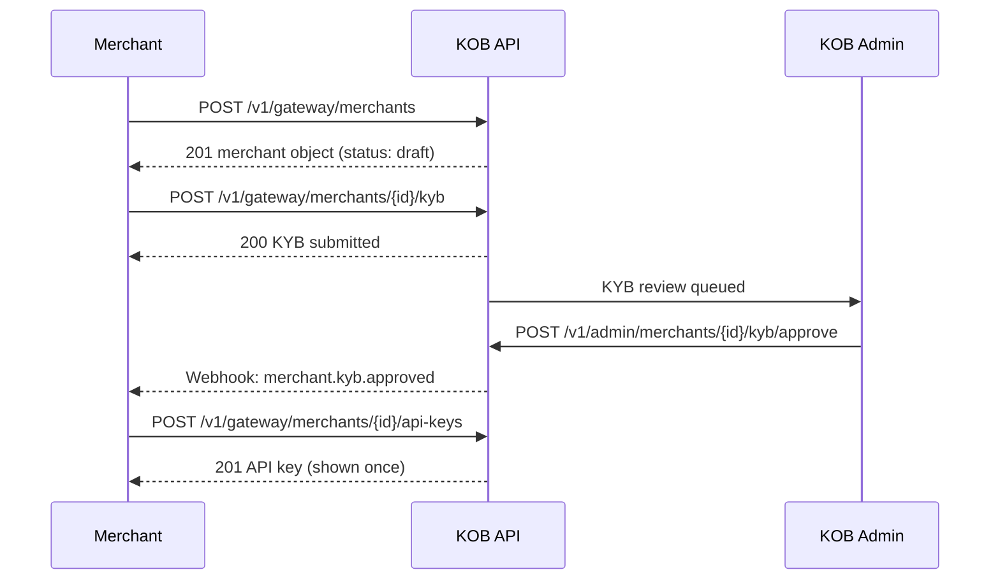

# Merchant Onboarding, KYB & API Keys

> **Who is this for?** Platform operators and merchants integrating with KOB's payment gateway.

## Flow Overview



## Endpoints Used

| Method | Path | Idempotency-Key |
|--------|------|-----------------|
| POST | `/v1/gateway/merchants` | ✅ |
| POST | `/v1/gateway/merchants/{id}/kyb` | ✅ |
| POST | `/v1/gateway/merchants/{id}/api-keys` | ✅ |
| POST | `/v1/gateway/merchants/{id}/api-keys/{keyId}/rotate` | ✅ |
| GET | `/v1/gateway/merchants/{id}` | — |

## 1. Create a Merchant

```bash
curl -X POST https://wdzkzeahdtxlynetndqw.supabase.co/functions/v1/gateway/merchants \
  -H "Authorization: Bearer <ACCESS_TOKEN>" \
  -H "Content-Type: application/json" \
  -H "Idempotency-Key: merchant_create_cafe_douala_20260323" \
  -d '{
    "business_name": "Cafe Douala",
    "business_type": "restaurant",
    "country": "CM",
    "currency": "XAF",
    "email": "contact@cafedouala.cm",
    "phone": "+237650000000"
  }'
```

### Success Response (201)

```json
{
  "id": "mrc_abc123",
  "business_name": "Cafe Douala",
  "status": "draft",
  "country": "CM",
  "currency": "XAF",
  "created_at": "2026-03-23T10:00:00Z"
}
```

## 2. Submit KYB Documents

```bash
curl -X POST https://wdzkzeahdtxlynetndqw.supabase.co/functions/v1/gateway/merchants/mrc_abc123/kyb \
  -H "Authorization: Bearer <ACCESS_TOKEN>" \
  -H "Content-Type: application/json" \
  -H "Idempotency-Key: kyb_submit_mrc_abc123" \
  -d '{
    "registration_number": "RC-2025-DLA-12345",
    "tax_id": "M012345678",
    "directors": [{"name": "Jean Kamga", "id_type": "national_id", "id_number": "CM123456789"}],
    "documents": ["doc_upload_id_1", "doc_upload_id_2"]
  }'
```

## 3. Generate API Keys (after approval)

```bash
curl -X POST https://wdzkzeahdtxlynetndqw.supabase.co/functions/v1/gateway/merchants/mrc_abc123/api-keys \
  -H "Authorization: Bearer <ACCESS_TOKEN>" \
  -H "Content-Type: application/json" \
  -H "Idempotency-Key: apikey_create_mrc_abc123_sandbox" \
  -d '{"environment": "sandbox"}'
```

### Success Response (201)

```json
{
  "id": "key_xyz789",
  "prefix": "sk_test_",
  "api_key": "sk_test_abcdef1234567890",
  "environment": "sandbox",
  "created_at": "2026-03-23T12:00:00Z",
  "warning": "Store this key securely. It will not be shown again."
}
```

## Webhook: KYB Approved

```json
{
  "event": "merchant.kyb.approved",
  "merchant_id": "mrc_abc123",
  "timestamp": "2026-03-23T14:00:00Z",
  "data": {
    "status": "active",
    "approved_at": "2026-03-23T14:00:00Z"
  }
}
```

## Error Example

```json
{
  "error": "validation_error",
  "error_code": "KYC_001",
  "message": "Missing required document: business registration certificate",
  "error_id": "err_kyb_missing_doc",
  "timestamp": "2026-03-23T10:05:00Z",
  "details": {
    "missing_fields": ["registration_certificate"]
  }
}
```
