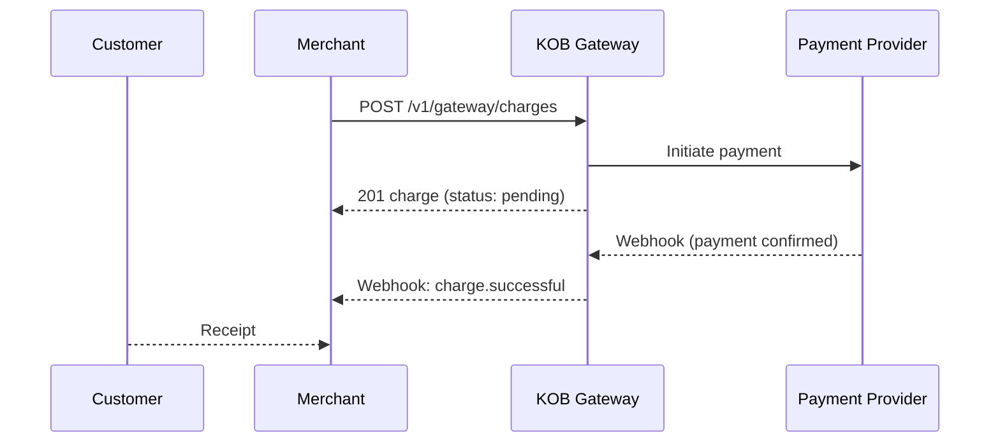

# Accept Payments — Create a Charge

> **Who is this for?** Merchants collecting payments via Mobile Money, Card, or PayPal.

## Flow Overview



## Endpoints Used

| Method | Path | Idempotency-Key |
|--------|------|-----------------|
| POST | `/v1/gateway/charges` | Required |
| GET | `/v1/gateway/charges/{id}` | -- |
| GET | `/v1/gateway/charges` | -- |

## 1. Create a Mobile Money Charge

```bash
curl -X POST https://wdzkzeahdtxlynetndqw.supabase.co/functions/v1/gateway/charges \
  -H "Authorization: Bearer <ACCESS_TOKEN>" \
  -H "Content-Type: application/json" \
  -H "Idempotency-Key: charge_order_1001_20260323" \
  -d '{
    "amount": 15000,
    "currency": "XAF",
    "payment_method": "mobile_money",
    "customer": {
      "phone": "+237677000001",
      "name": "Marie Fotso"
    },
    "description": "Order #1001",
    "metadata": {"order_id": "1001"}
  }'
```

### Success Response (201)

```json
{
  "id": "chg_abc123",
  "amount": 15000,
  "currency": "XAF",
  "status": "pending",
  "payment_method": "mobile_money",
  "created_at": "2026-03-23T10:00:00Z"
}
```

## 2. Retrieve a Charge

```bash
curl https://wdzkzeahdtxlynetndqw.supabase.co/functions/v1/gateway/charges/chg_abc123 \
  -H "Authorization: Bearer <ACCESS_TOKEN>"
```

## 3. List Charges (with pagination)

```bash
curl "https://wdzkzeahdtxlynetndqw.supabase.co/functions/v1/gateway/charges?page=1&limit=20&status=successful" \
  -H "Authorization: Bearer <ACCESS_TOKEN>"
```

## Webhook: Charge Successful

```json
{
  "event": "charge.successful",
  "charge_id": "chg_abc123",
  "timestamp": "2026-03-23T10:02:00Z",
  "data": {
    "amount": 15000,
    "currency": "XAF",
    "status": "successful",
    "payment_method": "mobile_money",
    "provider_reference": "FLW-MOCK-12345"
  }
}
```

## Error Example

```json
{
  "error": "invalid_request",
  "error_code": "PAY_001",
  "message": "Amount must be at least 100 XAF",
  "error_id": "err_charge_min_amount",
  "timestamp": "2026-03-23T10:00:00Z",
  "details": {
    "field": "amount",
    "minimum": 100
  }
}
```

## Idempotency Note

Always include `Idempotency-Key` when creating charges. If a network timeout occurs, retry with the **same key** -- KOB returns the cached result with `X-Idempotent-Replayed: true`.

---

## Handling Failures

### Charge Declined (PAY_002)

When the payment provider declines the transaction, you receive a `charge.failed` webhook:

```json
{
  "event": "charge.failed",
  "charge_id": "chg_abc123",
  "timestamp": "2026-03-23T10:02:00Z",
  "data": {
    "status": "failed",
    "failure_reason": "card_declined",
    "provider_code": "DECLINED_DO_NOT_HONOR"
  }
}
```

**Action:** Prompt the customer to use a different payment method. Create a **new** charge with a **new** idempotency key.

### Authorization Timeout (MM_003)

Mobile money charges require the customer to approve a USSD/STK prompt. If they do not respond within 30 seconds:

```json
{
  "error": "auth_timeout",
  "error_code": "MM_003",
  "message": "Customer did not approve the payment prompt within the timeout window.",
  "error_id": "err_mm_timeout_abc",
  "timestamp": "2026-03-23T10:01:00Z"
}
```

**Action:** Retry with the **same** idempotency key. The customer will receive a new prompt.

### Provider Unavailable (MM_004 / GEN_004)

When the upstream provider is temporarily unreachable:

```json
{
  "error": "provider_unavailable",
  "error_code": "MM_004",
  "message": "The mobile money provider is temporarily unreachable.",
  "error_id": "err_provider_down_xyz",
  "timestamp": "2026-03-23T10:00:00Z"
}
```

**Action:** Implement exponential backoff with the same idempotency key. Check the KOB status page for provider outages.

## Retry Logic (Node.js)

```javascript
async function createChargeWithRetry(chargeData, idempotencyKey, maxRetries = 3) {
  for (let attempt = 0; attempt <= maxRetries; attempt++) {
    const response = await fetch('https://wdzkzeahdtxlynetndqw.supabase.co/functions/v1/gateway/charges', {
      method: 'POST',
      headers: {
        'Authorization': `Bearer ${process.env.KOB_SECRET_KEY}`,
        'Content-Type': 'application/json',
        'Idempotency-Key': idempotencyKey,
      },
      body: JSON.stringify(chargeData),
    });

    // Success or non-retryable error
    if (response.status < 500 && response.status !== 408 && response.status !== 429) {
      return response.json();
    }

    // Respect Retry-After header
    const retryAfter = response.headers.get('Retry-After');
    const delay = retryAfter
      ? parseInt(retryAfter, 10) * 1000
      : Math.min(1000 * Math.pow(2, attempt), 30000);

    await new Promise(resolve => setTimeout(resolve, delay));
  }
  throw new Error('Max retries exceeded for charge creation');
}
```

## Edge Cases

| Scenario | What Happens | What to Do |
|----------|-------------|------------|
| Duplicate charge (same idempotency key, same payload) | Returns the original charge with `X-Idempotent-Replayed: true` | Safe -- no duplicate charge is created |
| Duplicate charge (same key, different payload) | Returns `409 Conflict` (PAY_004) | Use a new idempotency key for different charge parameters |
| Network timeout before receiving response | Charge may or may not have been created | Poll `GET /v1/gateway/charges?metadata.order_id=1001` to check, or retry with the same idempotency key |
| Webhook not received after 5 minutes | Provider may be slow or webhook delivery failed | Poll `GET /v1/gateway/charges/{id}` to check status. Do not assume failure |
| Charge stuck in `pending` for over 30 minutes | Provider has not confirmed or rejected | Contact support with the charge_id. Do not create a duplicate charge |
