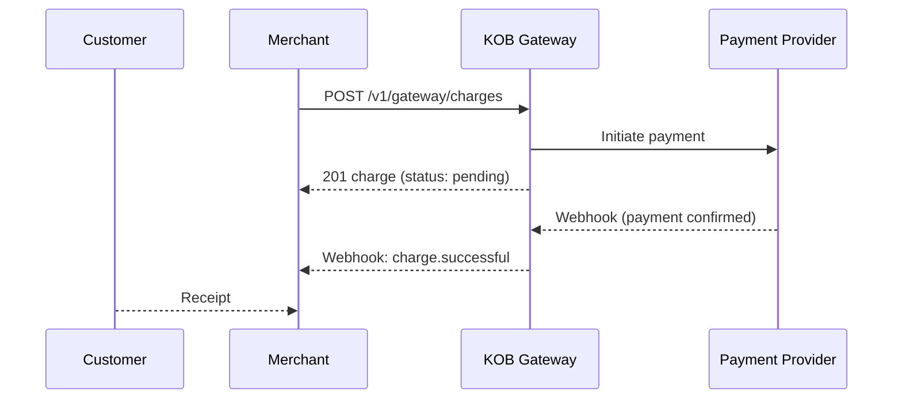

# Accept Payments — Create a Charge

> **Who is this for?** Merchants collecting payments via Mobile Money, Card, or PayPal.

## Flow Overview



## Endpoints Used

| Method | Path | Idempotency-Key |
|--------|------|-----------------|
| POST | `/v1/gateway/charges` | ✅ |
| GET | `/v1/gateway/charges/{id}` | — |
| GET | `/v1/gateway/charges` | — |

## 1. Create a Mobile Money Charge

```bash
curl -X POST https://api.kangopenbanking.com/v1/gateway/charges \
  -H "Authorization: Bearer <ACCESS_TOKEN>" \
  -H "Content-Type: application/json" \
  -H "Idempotency-Key: charge_order_1001_20260323" \
  -d '{
    "amount": 15000,
    "currency": "XAF",
    "payment_method": "mobile_money",
    "customer": {
      "phone": "+237677000001",
      "name": "Marie Fotso"
    },
    "description": "Order #1001",
    "metadata": {"order_id": "1001"}
  }'
```

### Success Response (201)

```json
{
  "id": "chg_abc123",
  "amount": 15000,
  "currency": "XAF",
  "status": "pending",
  "payment_method": "mobile_money",
  "created_at": "2026-03-23T10:00:00Z"
}
```

## 2. Retrieve a Charge

```bash
curl https://api.kangopenbanking.com/v1/gateway/charges/chg_abc123 \
  -H "Authorization: Bearer <ACCESS_TOKEN>"
```

## 3. List Charges (with pagination)

```bash
curl "https://api.kangopenbanking.com/v1/gateway/charges?limit=20&offset=0&status=successful" \
  -H "Authorization: Bearer <ACCESS_TOKEN>"
```

## Webhook: Charge Successful

```json
{
  "event": "charge.successful",
  "charge_id": "chg_abc123",
  "timestamp": "2026-03-23T10:02:00Z",
  "data": {
    "amount": 15000,
    "currency": "XAF",
    "status": "successful",
    "payment_method": "mobile_money",
    "provider_reference": "FLW-MOCK-12345"
  }
}
```

## Error Example

```json
{
  "error": "invalid_request",
  "error_code": "PAY_001",
  "message": "Amount must be at least 100 XAF",
  "error_id": "err_charge_min_amount",
  "timestamp": "2026-03-23T10:00:00Z",
  "details": {
    "field": "amount",
    "minimum": 100
  }
}
```

## Idempotency Note

Always include `Idempotency-Key` when creating charges. If a network timeout occurs, retry with the **same key** — KOB returns the cached result with `X-Idempotent-Replayed: true`.
