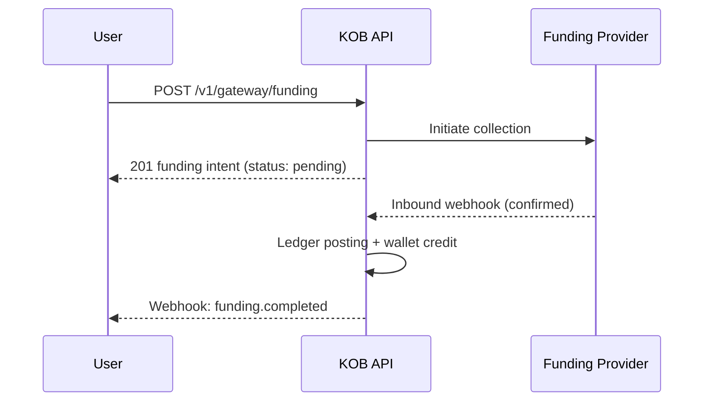

# Add Money — Account Funding

> **Who is this for?** Consumers or businesses funding their KOB wallet via Mobile Money, card, or bank transfer.

## Flow Overview



## Endpoints Used

| Method | Path | Idempotency-Key |
|--------|------|-----------------|
| POST | `/v1/gateway/funding` | ✅ |
| GET | `/v1/gateway/funding/{id}` | — |

## 1. Create a Funding Intent (Mobile Money)

```bash
curl -X POST https://wdzkzeahdtxlynetndqw.supabase.co/functions/v1/gateway/funding \
  -H "Authorization: Bearer <ACCESS_TOKEN>" \
  -H "Content-Type: application/json" \
  -H "Idempotency-Key: fund_wallet_user123_20260323" \
  -d '{
    "amount": 50000,
    "currency": "XAF",
    "source": "mobile_money",
    "phone": "+237677000001",
    "description": "Add money to wallet"
  }'
```

### Success Response (201)

```json
{
  "id": "fund_xyz789",
  "amount": 50000,
  "currency": "XAF",
  "status": "pending",
  "source": "mobile_money",
  "created_at": "2026-03-23T10:00:00Z"
}
```

## 2. Check Funding Status

```bash
curl https://wdzkzeahdtxlynetndqw.supabase.co/functions/v1/gateway/funding/fund_xyz789 \
  -H "Authorization: Bearer <ACCESS_TOKEN>"
```

## Webhook: Funding Completed

```json
{
  "event": "funding.completed",
  "funding_id": "fund_xyz789",
  "timestamp": "2026-03-23T10:02:00Z",
  "data": {
    "amount": 50000,
    "currency": "XAF",
    "status": "completed",
    "wallet_balance": 150000
  }
}
```

## Provider Inbound Webhook Note

When the payment provider confirms the collection, KOB receives an inbound webhook:
- **Flutterwave**: `POST /webhooks/flutterwave` — requires `verif-hash` header
- **Stripe**: `POST /webhooks/stripe` — requires `stripe-signature` header

These are verified, deduplicated, and used to finalize the funding transaction. You do not need to call these endpoints — they are provider-to-KOB only.

## Error Example

```json
{
  "error": "insufficient_funds",
  "error_code": "PAY_003",
  "message": "Mobile money account has insufficient balance",
  "error_id": "err_fund_insufficient",
  "timestamp": "2026-03-23T10:00:00Z",
  "details": {}
}
```
