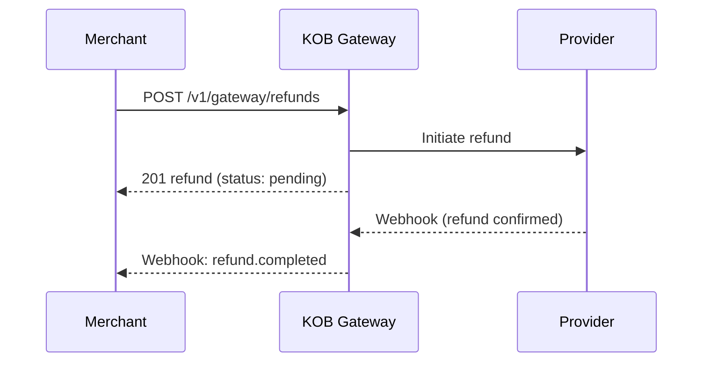

# Refunds

> **Who is this for?** Merchants processing full or partial refunds on successful charges.

## Flow Overview



## Endpoints Used

| Method | Path | Idempotency-Key |
|--------|------|-----------------|
| POST | `/v1/gateway/refunds` | ✅ |
| GET | `/v1/gateway/refunds/{id}` | — |
| GET | `/v1/gateway/refunds` | — |

## 1. Create a Full Refund

```bash
curl -X POST https://api.kangopenbanking.com/v1/gateway/refunds \
  -H "Authorization: Bearer <ACCESS_TOKEN>" \
  -H "Content-Type: application/json" \
  -H "Idempotency-Key: refund_order_1001_20260323" \
  -d '{
    "charge_id": "chg_abc123",
    "reason": "Customer request"
  }'
```

### Success Response (201)

```json
{
  "id": "ref_xyz789",
  "charge_id": "chg_abc123",
  "amount": 15000,
  "currency": "XAF",
  "status": "pending",
  "reason": "Customer request",
  "created_at": "2026-03-23T10:05:00Z"
}
```

## 2. Create a Partial Refund

```bash
curl -X POST https://api.kangopenbanking.com/v1/gateway/refunds \
  -H "Authorization: Bearer <ACCESS_TOKEN>" \
  -H "Content-Type: application/json" \
  -H "Idempotency-Key: refund_partial_order_1001" \
  -d '{
    "charge_id": "chg_abc123",
    "amount": 5000,
    "reason": "Partial item return"
  }'
```

## Webhook: Refund Completed

```json
{
  "event": "refund.completed",
  "refund_id": "ref_xyz789",
  "timestamp": "2026-03-23T10:10:00Z",
  "data": {
    "amount": 15000,
    "currency": "XAF",
    "status": "completed",
    "charge_id": "chg_abc123"
  }
}
```

## Error Example

```json
{
  "error": "invalid_request",
  "error_code": "PAY_005",
  "message": "Refund amount exceeds remaining refundable amount",
  "error_id": "err_refund_exceeds",
  "timestamp": "2026-03-23T10:05:00Z",
  "details": {
    "charge_amount": 15000,
    "already_refunded": 10000,
    "requested": 10000
  }
}
```

## Constraints

- Only `successful` charges can be refunded.
- Cannot refund charges older than 180 days.
- Multiple partial refunds are allowed until the total equals the original charge amount.
