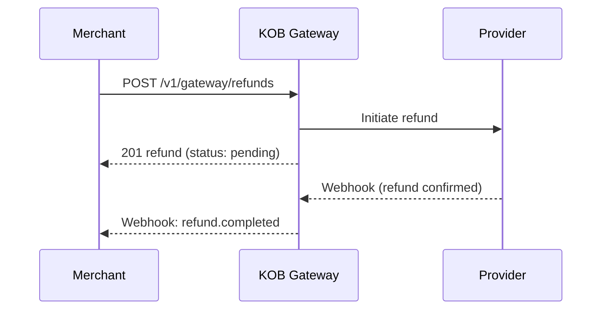

# Refunds

> **Who is this for?** Merchants processing full or partial refunds on successful charges.

## Flow Overview



## Endpoints Used

| Method | Path | Idempotency-Key |
|--------|------|-----------------|
| POST | `/v1/gateway/refunds` | Required |
| GET | `/v1/gateway/refunds/{id}` | -- |
| GET | `/v1/gateway/refunds` | -- |

## 1. Create a Full Refund

```bash
curl -X POST https://api.kangopenbanking.com/v1/gateway/refunds \
  -H "Authorization: Bearer <ACCESS_TOKEN>" \
  -H "Content-Type: application/json" \
  -H "Idempotency-Key: refund_order_1001_20260323" \
  -d '{
    "charge_id": "chg_abc123",
    "reason": "Customer request"
  }'
```

### Success Response (201)

```json
{
  "id": "ref_xyz789",
  "charge_id": "chg_abc123",
  "amount": 15000,
  "currency": "XAF",
  "status": "pending",
  "reason": "Customer request",
  "created_at": "2026-03-23T10:05:00Z"
}
```

## 2. Create a Partial Refund

```bash
curl -X POST https://api.kangopenbanking.com/v1/gateway/refunds \
  -H "Authorization: Bearer <ACCESS_TOKEN>" \
  -H "Content-Type: application/json" \
  -H "Idempotency-Key: refund_partial_order_1001" \
  -d '{
    "charge_id": "chg_abc123",
    "amount": 5000,
    "reason": "Partial item return"
  }'
```

## Webhook: Refund Completed

```json
{
  "event": "refund.completed",
  "refund_id": "ref_xyz789",
  "timestamp": "2026-03-23T10:10:00Z",
  "data": {
    "amount": 15000,
    "currency": "XAF",
    "status": "completed",
    "charge_id": "chg_abc123"
  }
}
```

## Error Example

```json
{
  "error": "invalid_request",
  "error_code": "PAY_005",
  "message": "Refund amount exceeds remaining refundable amount",
  "error_id": "err_refund_exceeds",
  "timestamp": "2026-03-23T10:05:00Z",
  "details": {
    "charge_amount": 15000,
    "already_refunded": 10000,
    "requested": 10000
  }
}
```

## Constraints

- Only `successful` charges can be refunded.
- Cannot refund charges older than 180 days.
- Multiple partial refunds are allowed until the total equals the original charge amount.

---

## Handling Failures

### Refund Failed (Provider Error)

The refund provider may reject the operation. You will receive a `refund.failed` webhook:

```json
{
  "event": "refund.failed",
  "refund_id": "ref_xyz789",
  "timestamp": "2026-03-23T10:12:00Z",
  "data": {
    "status": "failed",
    "failure_reason": "provider_rejected",
    "charge_id": "chg_abc123"
  }
}
```

**Action:** Check the failure reason. For transient provider errors, retry with the same idempotency key. For permanent rejections, consider an out-of-band refund (e.g., bank transfer).

### Refund on a Disputed Charge

Attempting to refund a charge that is under active dispute returns:

```json
{
  "error": "invalid_request",
  "error_code": "PAY_009",
  "message": "Cannot refund a charge with an active dispute.",
  "error_id": "err_refund_dispute",
  "timestamp": "2026-03-23T10:05:00Z",
  "details": {
    "dispute_id": "dsp_abc456",
    "dispute_status": "under_review"
  }
}
```

**Action:** Wait for dispute resolution. If the dispute is resolved in your favour, you can then process the refund.

## Edge Cases

| Scenario | What Happens | What to Do |
|----------|-------------|------------|
| Refund amount exceeds remaining balance | Returns `422` with PAY_005, showing charge_amount, already_refunded, and requested | Adjust the refund amount to `charge_amount - already_refunded` |
| Refund on a charge older than 180 days | Returns `422` with an expiry error | Process the refund out-of-band (bank transfer to customer) |
| Full refund after partial refunds | Only the remaining amount is refunded | Omit the `amount` field to refund the full remaining balance |
| Charge is in `pending` status | Returns `422` -- cannot refund an incomplete charge | Wait for the charge to reach `successful` status first |
| Duplicate refund (same idempotency key) | Returns the original refund with `X-Idempotent-Replayed: true` | Safe -- no duplicate refund is created |
| Provider timeout during refund | Refund stays in `pending` | Poll `GET /v1/gateway/refunds/{id}` to check status. The provider will eventually confirm or reject |
