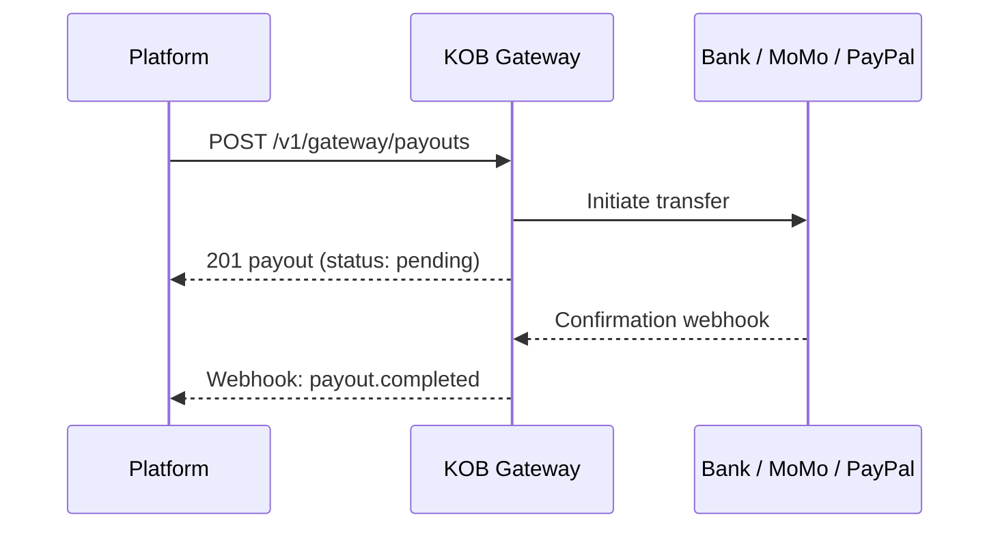

# Payouts — Single, Bulk & PayPal

> **Who is this for?** Merchants and platforms disbursing funds to recipients via bank, Mobile Money, or PayPal.

## Flow Overview



## Endpoints Used

| Method | Path | Idempotency-Key |
|--------|------|-----------------|
| POST | `/v1/gateway/payouts` | ✅ |
| GET | `/v1/gateway/payouts/{id}` | — |
| POST | `/v1/gateway/payouts/bulk` | ✅ |
| GET | `/v1/gateway/payouts/bulk/{id}` | — |

## 1. Single Payout (Mobile Money)

```bash
curl -X POST https://api.kangopenbanking.com/v1/gateway/payouts \
  -H "Authorization: Bearer <ACCESS_TOKEN>" \
  -H "Content-Type: application/json" \
  -H "Idempotency-Key: payout_emp_001_march2026" \
  -d '{
    "amount": 25000,
    "currency": "XAF",
    "recipient": {
      "type": "mobile_money",
      "phone": "+237677000002",
      "name": "Paul Njoya"
    },
    "description": "March salary"
  }'
```

### Success Response (201)

```json
{
  "id": "pay_abc123",
  "amount": 25000,
  "currency": "XAF",
  "status": "pending",
  "recipient": {
    "type": "mobile_money",
    "phone": "+237677000002"
  },
  "created_at": "2026-03-23T10:00:00Z"
}
```

## 2. Bulk Payout

```bash
curl -X POST https://api.kangopenbanking.com/v1/gateway/payouts/bulk \
  -H "Authorization: Bearer <ACCESS_TOKEN>" \
  -H "Content-Type: application/json" \
  -H "Idempotency-Key: bulk_payout_march_salaries" \
  -d '{
    "description": "March payroll",
    "items": [
      {"amount": 25000, "currency": "XAF", "recipient": {"type": "mobile_money", "phone": "+237677000002", "name": "Paul Njoya"}},
      {"amount": 30000, "currency": "XAF", "recipient": {"type": "mobile_money", "phone": "+237677000003", "name": "Aisha Bello"}}
    ]
  }'
```

## Webhook: Payout Completed

```json
{
  "event": "payout.completed",
  "payout_id": "pay_abc123",
  "timestamp": "2026-03-23T10:05:00Z",
  "data": {
    "amount": 25000,
    "currency": "XAF",
    "status": "completed",
    "provider_reference": "FLW-PAY-67890"
  }
}
```

## Error Example

```json
{
  "error": "payout_failed",
  "error_code": "PAY_010",
  "message": "Insufficient settlement balance for payout",
  "error_id": "err_payout_balance",
  "timestamp": "2026-03-23T10:00:00Z",
  "details": {
    "available_balance": 10000,
    "requested": 25000
  }
}
```
