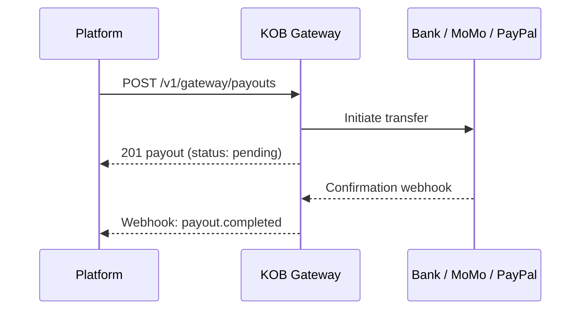

# Payouts — Single, Bulk & PayPal

> **Who is this for?** Merchants and platforms disbursing funds to recipients via bank, Mobile Money, or PayPal.

## Flow Overview



## Endpoints Used

| Method | Path | Idempotency-Key |
|--------|------|-----------------|
| POST | `/v1/gateway/payouts` | Required |
| GET | `/v1/gateway/payouts/{id}` | -- |
| POST | `/v1/gateway/payouts/bulk` | Required |
| GET | `/v1/gateway/payouts/bulk/{id}` | -- |

## 1. Single Payout (Mobile Money)

```bash
curl -X POST https://wdzkzeahdtxlynetndqw.supabase.co/functions/v1/gateway/payouts \
  -H "Authorization: Bearer <ACCESS_TOKEN>" \
  -H "Content-Type: application/json" \
  -H "Idempotency-Key: payout_emp_001_march2026" \
  -d '{
    "amount": 25000,
    "currency": "XAF",
    "recipient": {
      "type": "mobile_money",
      "phone": "+237677000002",
      "name": "Paul Njoya"
    },
    "description": "March salary"
  }'
```

### Success Response (201)

```json
{
  "id": "pay_abc123",
  "amount": 25000,
  "currency": "XAF",
  "status": "pending",
  "recipient": {
    "type": "mobile_money",
    "phone": "+237677000002"
  },
  "created_at": "2026-03-23T10:00:00Z"
}
```

## 2. Bulk Payout

```bash
curl -X POST https://wdzkzeahdtxlynetndqw.supabase.co/functions/v1/gateway/payouts/bulk \
  -H "Authorization: Bearer <ACCESS_TOKEN>" \
  -H "Content-Type: application/json" \
  -H "Idempotency-Key: bulk_payout_march_salaries" \
  -d '{
    "description": "March payroll",
    "items": [
      {"amount": 25000, "currency": "XAF", "recipient": {"type": "mobile_money", "phone": "+237677000002", "name": "Paul Njoya"}},
      {"amount": 30000, "currency": "XAF", "recipient": {"type": "mobile_money", "phone": "+237677000003", "name": "Aisha Bello"}}
    ]
  }'
```

## Webhook: Payout Completed

```json
{
  "event": "payout.completed",
  "payout_id": "pay_abc123",
  "timestamp": "2026-03-23T10:05:00Z",
  "data": {
    "amount": 25000,
    "currency": "XAF",
    "status": "completed",
    "provider_reference": "FLW-PAY-67890"
  }
}
```

## Error Example

```json
{
  "error": "payout_failed",
  "error_code": "PAY_010",
  "message": "Insufficient settlement balance for payout",
  "error_id": "err_payout_balance",
  "timestamp": "2026-03-23T10:00:00Z",
  "details": {
    "available_balance": 10000,
    "requested": 25000
  }
}
```

---

## Handling Failures

### Insufficient Balance (PAY_010)

When your settlement balance is too low for a payout:

**Action:** Wait for pending charges to settle (typically T+1), or reduce the payout amount. You can check your available balance via `GET /v1/gateway/balance`.

### Payout Failed at Provider (PAY_006)

The payout may fail at the bank or mobile money provider level:

```json
{
  "event": "payout.failed",
  "payout_id": "pay_abc123",
  "timestamp": "2026-03-23T10:07:00Z",
  "data": {
    "status": "failed",
    "failure_reason": "invalid_account",
    "provider_code": "ACCOUNT_NOT_FOUND"
  }
}
```

**Action:** Check the failure reason. Common causes include invalid account numbers, closed accounts, or name mismatches. Verify recipient details and retry with a new idempotency key.

### Reversal Flow

If a payout was sent but the recipient's account rejects it (e.g., account closed after payout was initiated), you will receive a `payout.reversed` webhook:

```json
{
  "event": "payout.reversed",
  "payout_id": "pay_abc123",
  "timestamp": "2026-03-23T12:00:00Z",
  "data": {
    "status": "reversed",
    "reversal_reason": "recipient_account_closed",
    "amount": 25000,
    "currency": "XAF"
  }
}
```

**Action:** The funds are returned to your settlement balance. Verify the recipient's details and retry if appropriate.

## Retry Logic (Python)

```python
import time
import requests

def create_payout_with_retry(payout_data, idempotency_key, max_retries=3):
    headers = {
        "Authorization": f"Bearer {API_KEY}",
        "Content-Type": "application/json",
        "Idempotency-Key": idempotency_key,
    }
    for attempt in range(max_retries + 1):
        resp = requests.post(
            "https://wdzkzeahdtxlynetndqw.supabase.co/functions/v1/gateway/payouts",
            json=payout_data, headers=headers,
        )
        if resp.status_code < 500 and resp.status_code not in (408, 429):
            return resp.json()

        retry_after = resp.headers.get("Retry-After")
        delay = int(retry_after) if retry_after else min(2 ** attempt, 30)
        time.sleep(delay)

    raise Exception("Max retries exceeded for payout creation")
```

## Edge Cases

| Scenario | What Happens | What to Do |
|----------|-------------|------------|
| Bulk payout with one invalid recipient | The valid payouts proceed; the invalid one returns an error in the `items` response | Check each item's status individually. Retry only the failed items |
| Payout to a phone number with wrong operator prefix | Returns `422` with MM_002 | Verify the phone number format and operator prefix before submitting |
| Duplicate payout (same idempotency key) | Returns the original payout with `X-Idempotent-Replayed: true` | Safe -- no duplicate payout is sent |
| Provider unavailable during bulk payout | Items that reached the provider may succeed; others may fail | Poll `GET /v1/gateway/payouts/bulk/{id}` for per-item status |
| Settlement balance covers only partial bulk payout | The entire bulk payout is rejected (not partially processed) | Reduce the total amount or wait for more settlements |
| Payout stuck in `pending` for over 1 hour | Provider has not confirmed | Poll status. Contact support if the payout remains pending after 4 hours |
