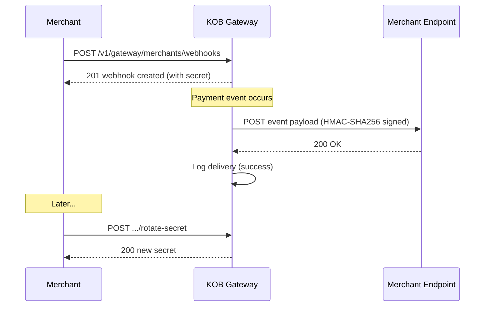

# Webhooks — Merchant Setup, Deliveries & Secret Rotation

> **Who is this for?** Merchants configuring webhook endpoints to receive real-time payment event notifications.

## Flow Overview



## Endpoints Used

| Method | Path | Idempotency-Key |
|--------|------|-----------------|
| POST | `/v1/gateway/merchants/webhooks` | ✅ |
| GET | `/v1/gateway/merchants/webhooks` | — |
| POST | `/v1/gateway/merchants/webhooks/{id}/rotate-secret` | ✅ |
| GET | `/v1/gateway/merchants/webhooks/{id}/deliveries` | — |

## 1. Register a Webhook Endpoint

```bash
curl -X POST https://wdzkzeahdtxlynetndqw.supabase.co/functions/v1/gateway/merchants/webhooks \
  -H "Authorization: Bearer <ACCESS_TOKEN>" \
  -H "Content-Type: application/json" \
  -H "Idempotency-Key: webhook_create_mrc_abc123" \
  -d '{
    "merchant_id": "mrc_abc123",
    "url": "https://mystore.cm/webhooks/kob",
    "events": ["charge.successful", "charge.failed", "refund.completed", "payout.completed"]
  }'
```

### Success Response (201)

```json
{
  "id": "wh_xyz789",
  "url": "https://mystore.cm/webhooks/kob",
  "events": ["charge.successful", "charge.failed", "refund.completed", "payout.completed"],
  "secret": "whsec_abcdef1234567890",
  "active": true,
  "created_at": "2026-03-23T10:00:00Z",
  "warning": "Store this secret securely. It will not be shown again."
}
```

## 2. Rotate Webhook Secret

```bash
curl -X POST https://wdzkzeahdtxlynetndqw.supabase.co/functions/v1/gateway/merchants/webhooks/wh_xyz789/rotate-secret \
  -H "Authorization: Bearer <ACCESS_TOKEN>" \
  -H "Idempotency-Key: rotate_secret_wh_xyz789"
```

## 3. Check Delivery Logs

```bash
curl "https://wdzkzeahdtxlynetndqw.supabase.co/functions/v1/gateway/merchants/webhooks/wh_xyz789/deliveries?page=1&limit=10" \
  -H "Authorization: Bearer <ACCESS_TOKEN>"
```

## Verifying Webhook Signatures

KOB signs outbound webhooks with HMAC-SHA256. Verify in your handler:

```javascript
const crypto = require('crypto');

function verifyWebhook(payload, signature, secret) {
  const expected = crypto
    .createHmac('sha256', secret)
    .update(payload)
    .digest('hex');
  return crypto.timingSafeEqual(
    Buffer.from(signature),
    Buffer.from(expected)
  );
}
```

## Retry Policy

| Attempt | Delay |
|---------|-------|
| 1 | Immediate |
| 2 | 1 minute |
| 3 | 5 minutes |
| 4 | 30 minutes |
| 5 | 2 hours |
| 6 | 12 hours |
| 7 | 24 hours (final) |

After 7 failed attempts, the event is moved to a dead-letter queue visible in your Merchant Dashboard.

## Error Example

```json
{
  "error": "invalid_request",
  "error_code": "WH_001",
  "message": "Webhook URL must use HTTPS",
  "error_id": "err_wh_http",
  "timestamp": "2026-03-23T10:00:00Z",
  "details": {
    "field": "url"
  }
}
```
