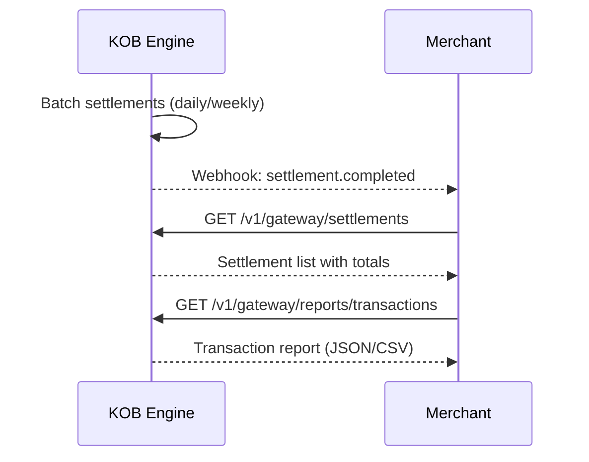

# Settlements, Reporting & Reconciliation

> **Who is this for?** Finance teams and merchants reviewing settlements, generating reports, and reconciling transactions.

## Flow Overview



## Endpoints Used

| Method | Path | Idempotency-Key |
|--------|------|-----------------|
| GET | `/v1/gateway/settlements` | — |
| GET | `/v1/gateway/settlements/{id}` | — |
| GET | `/v1/gateway/reports/transactions` | — |
| GET | `/v1/gateway/reports/fees` | — |

## 1. List Settlements

```bash
curl "https://wdzkzeahdtxlynetndqw.supabase.co/functions/v1/gateway/settlements?page=1&limit=10" \
  -H "Authorization: Bearer <ACCESS_TOKEN>"
```

### Success Response (200)

```json
{
  "data": [
    {
      "id": "stl_abc123",
      "merchant_id": "mrc_abc123",
      "amount": 450000,
      "currency": "XAF",
      "fee": 4500,
      "net_amount": 445500,
      "status": "completed",
      "period_start": "2026-03-01",
      "period_end": "2026-03-07",
      "settled_at": "2026-03-08T06:00:00Z"
    }
  ],
  "pagination": {
    "total": 12,
    "limit": 10,
    "offset": 0
  }
}
```

## 2. Transaction Report

```bash
curl "https://wdzkzeahdtxlynetndqw.supabase.co/functions/v1/gateway/reports/transactions?from=2026-03-01&to=2026-03-23&format=json" \
  -H "Authorization: Bearer <ACCESS_TOKEN>"
```

## Webhook: Settlement Completed

```json
{
  "event": "settlement.completed",
  "settlement_id": "stl_abc123",
  "timestamp": "2026-03-08T06:00:00Z",
  "data": {
    "amount": 450000,
    "currency": "XAF",
    "net_amount": 445500,
    "transaction_count": 45
  }
}
```

## Reconciliation Guidance

1. Fetch your settlement via `GET /v1/gateway/settlements/{id}`
2. Compare `net_amount` against provider settlement reports
3. If mismatches are found, check the reconciliation dashboard in the Admin Portal
4. Mismatches are categorized: `missing_event`, `double_event`, `fee_mismatch`, `wrong_amount`

## Error Example

```json
{
  "error": "invalid_request",
  "error_code": "PAY_020",
  "message": "Date range exceeds maximum of 90 days",
  "error_id": "err_report_range",
  "timestamp": "2026-03-23T10:00:00Z",
  "details": {
    "max_days": 90
  }
}
```
