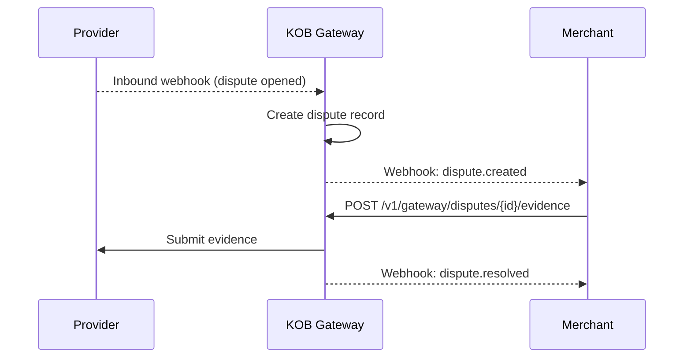

# Disputes & Chargebacks

> **Who is this for?** Merchants handling disputes and submitting evidence for chargebacks.

## Flow Overview



## Endpoints Used

| Method | Path | Idempotency-Key |
|--------|------|-----------------|
| GET | `/v1/gateway/disputes` | — |
| GET | `/v1/gateway/disputes/{id}` | — |
| POST | `/v1/gateway/disputes/{id}/evidence` | ✅ |

## 1. List Disputes

```bash
curl "https://wdzkzeahdtxlynetndqw.supabase.co/functions/v1/gateway/disputes?page=1&limit=10&status=open" \
  -H "Authorization: Bearer <ACCESS_TOKEN>"
```

### Success Response (200)

```json
{
  "data": [
    {
      "id": "dsp_abc123",
      "charge_id": "chg_xyz789",
      "amount": 15000,
      "currency": "XAF",
      "reason": "product_not_received",
      "status": "open",
      "due_date": "2026-04-06T23:59:59Z",
      "created_at": "2026-03-23T10:00:00Z"
    }
  ],
  "pagination": {
    "total": 1,
    "limit": 10,
    "offset": 0
  }
}
```

## 2. Submit Evidence

```bash
curl -X POST https://wdzkzeahdtxlynetndqw.supabase.co/functions/v1/gateway/disputes/dsp_abc123/evidence \
  -H "Authorization: Bearer <ACCESS_TOKEN>" \
  -H "Content-Type: application/json" \
  -H "Idempotency-Key: evidence_dsp_abc123" \
  -d '{
    "evidence_type": "shipping_proof",
    "description": "Package delivered and signed for",
    "document_ids": ["doc_evidence_001"]
  }'
```

## Webhook: Dispute Created

```json
{
  "event": "dispute.created",
  "dispute_id": "dsp_abc123",
  "timestamp": "2026-03-23T10:00:00Z",
  "data": {
    "charge_id": "chg_xyz789",
    "amount": 15000,
    "currency": "XAF",
    "reason": "product_not_received",
    "due_date": "2026-04-06T23:59:59Z"
  }
}
```

## Error Example

```json
{
  "error": "dispute_closed",
  "error_code": "PAY_030",
  "message": "Cannot submit evidence for a resolved dispute",
  "error_id": "err_dispute_closed",
  "timestamp": "2026-03-23T10:00:00Z",
  "details": {
    "dispute_status": "resolved"
  }
}
```
