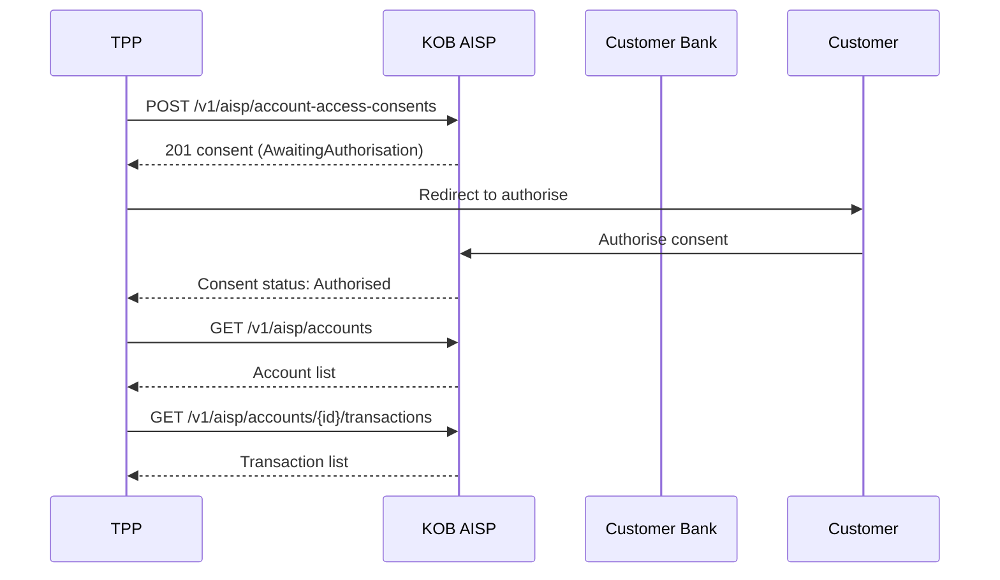

# Open Banking — AISP: Consent, Accounts & Transactions

> **Who is this for?** Third-party providers (TPPs) accessing customer account data via Open Banking AISP APIs.

## Flow Overview



## Endpoints Used

| Method | Path | Idempotency-Key |
|--------|------|-----------------|
| POST | `/v1/aisp/account-access-consents` | ✅ |
| GET | `/v1/aisp/account-access-consents/{id}` | — |
| DELETE | `/v1/aisp/account-access-consents/{id}` | — |
| GET | `/v1/aisp/accounts` | — |
| GET | `/v1/aisp/accounts/{id}` | — |
| GET | `/v1/aisp/accounts/{id}/balances` | — |
| GET | `/v1/aisp/accounts/{id}/transactions` | — |

## 1. Create Account Access Consent

```bash
curl -X POST https://wdzkzeahdtxlynetndqw.supabase.co/functions/v1/aisp/account-access-consents \
  -H "Authorization: Bearer <ACCESS_TOKEN>" \
  -H "Content-Type: application/json" \
  -H "Idempotency-Key: consent_tpp_001_20260323" \
  -H "x-fapi-interaction-id: 93bac548-d2de-4546-b106-880a5018460d" \
  -d '{
    "Data": {
      "Permissions": [
        "ReadAccountsBasic",
        "ReadAccountsDetail",
        "ReadBalances",
        "ReadTransactionsBasic",
        "ReadTransactionsDetail"
      ],
      "ExpirationDateTime": "2026-06-23T00:00:00Z",
      "TransactionFromDateTime": "2026-01-01T00:00:00Z",
      "TransactionToDateTime": "2026-12-31T23:59:59Z"
    }
  }'
```

### Success Response (201)

```json
{
  "Data": {
    "ConsentId": "cns_abc123",
    "Status": "AwaitingAuthorisation",
    "Permissions": [
      "ReadAccountsBasic",
      "ReadAccountsDetail",
      "ReadBalances",
      "ReadTransactionsBasic",
      "ReadTransactionsDetail"
    ],
    "CreationDateTime": "2026-03-23T10:00:00Z",
    "ExpirationDateTime": "2026-06-23T00:00:00Z"
  },
  "Links": {
    "Self": "/v1/aisp/account-access-consents/cns_abc123"
  }
}
```

## 2. List Accounts (after consent authorised)

```bash
curl https://wdzkzeahdtxlynetndqw.supabase.co/functions/v1/aisp/accounts \
  -H "Authorization: Bearer <ACCESS_TOKEN>" \
  -H "x-fapi-interaction-id: 93bac548-d2de-4546-b106-880a5018460d"
```

## 3. Get Transactions (with pagination)

```bash
curl "https://wdzkzeahdtxlynetndqw.supabase.co/functions/v1/aisp/accounts/acc_001/transactions?page=1&limit=25" \
  -H "Authorization: Bearer <ACCESS_TOKEN>" \
  -H "x-fapi-interaction-id: 93bac548-d2de-4546-b106-880a5018460d"
```

## Error Example

```json
{
  "error": "consent_expired",
  "error_code": "AISP_002",
  "message": "Account access consent has expired",
  "error_id": "err_consent_expired",
  "timestamp": "2026-03-23T10:00:00Z",
  "details": {
    "consent_id": "cns_abc123",
    "expired_at": "2026-06-23T00:00:00Z"
  }
}
```

## FAPI Headers

All AISP requests should include:
- `x-fapi-interaction-id` — UUID for request tracing
- `x-fapi-auth-date` — date of last customer authentication
- `x-fapi-customer-ip-address` — customer IP (when applicable)
