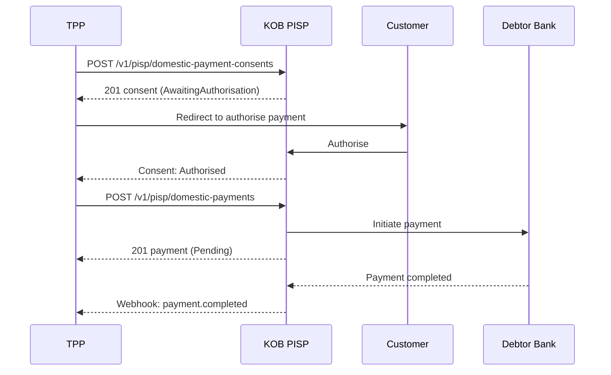

# Open Banking — PISP: Consent & Domestic Payment

> **Who is this for?** Third-party providers (TPPs) initiating payments on behalf of customers via Open Banking PISP APIs.

## Flow Overview



## Endpoints Used

| Method | Path | Idempotency-Key |
|--------|------|-----------------|
| POST | `/v1/pisp/domestic-payment-consents` | ✅ |
| GET | `/v1/pisp/domestic-payment-consents/{id}` | — |
| POST | `/v1/pisp/domestic-payments` | ✅ |
| GET | `/v1/pisp/domestic-payments/{id}` | — |

## 1. Create Payment Consent

```bash
curl -X POST https://wdzkzeahdtxlynetndqw.supabase.co/functions/v1/pisp/domestic-payment-consents \
  -H "Authorization: Bearer <ACCESS_TOKEN>" \
  -H "Content-Type: application/json" \
  -H "Idempotency-Key: pisp_consent_inv_2001_20260323" \
  -H "x-fapi-interaction-id: a1b2c3d4-e5f6-7890-abcd-ef1234567890" \
  -H "x-jws-signature: <detached_jws>" \
  -d '{
    "Data": {
      "Initiation": {
        "InstructionIdentification": "INV-2001",
        "EndToEndIdentification": "E2E-INV-2001",
        "InstructedAmount": {
          "Amount": "75000",
          "Currency": "XAF"
        },
        "CreditorAccount": {
          "SchemeName": "CM.RIB",
          "Identification": "10005-00001-12345678901-42",
          "Name": "Supplier SARL"
        }
      }
    }
  }'
```

### Success Response (201)

```json
{
  "Data": {
    "ConsentId": "pcon_xyz789",
    "Status": "AwaitingAuthorisation",
    "Initiation": {
      "InstructionIdentification": "INV-2001",
      "EndToEndIdentification": "E2E-INV-2001",
      "InstructedAmount": {
        "Amount": "75000",
        "Currency": "XAF"
      },
      "CreditorAccount": {
        "SchemeName": "CM.RIB",
        "Identification": "10005-00001-12345678901-42",
        "Name": "Supplier SARL"
      }
    },
    "CreationDateTime": "2026-03-23T10:00:00Z"
  },
  "Links": {
    "Self": "/v1/pisp/domestic-payment-consents/pcon_xyz789"
  }
}
```

## 2. Execute the Payment (after authorisation)

```bash
curl -X POST https://wdzkzeahdtxlynetndqw.supabase.co/functions/v1/pisp/domestic-payments \
  -H "Authorization: Bearer <ACCESS_TOKEN>" \
  -H "Content-Type: application/json" \
  -H "Idempotency-Key: pisp_pay_inv_2001_20260323" \
  -H "x-fapi-interaction-id: a1b2c3d4-e5f6-7890-abcd-ef1234567890" \
  -H "x-jws-signature: <detached_jws>" \
  -d '{
    "Data": {
      "ConsentId": "pcon_xyz789",
      "Initiation": {
        "InstructionIdentification": "INV-2001",
        "EndToEndIdentification": "E2E-INV-2001",
        "InstructedAmount": {
          "Amount": "75000",
          "Currency": "XAF"
        },
        "CreditorAccount": {
          "SchemeName": "CM.RIB",
          "Identification": "10005-00001-12345678901-42",
          "Name": "Supplier SARL"
        }
      }
    }
  }'
```

### Success Response (201)

```json
{
  "Data": {
    "DomesticPaymentId": "dp_abc123",
    "ConsentId": "pcon_xyz789",
    "Status": "Pending",
    "CreationDateTime": "2026-03-23T10:05:00Z",
    "Initiation": {
      "InstructedAmount": {
        "Amount": "75000",
        "Currency": "XAF"
      }
    }
  },
  "Links": {
    "Self": "/v1/pisp/domestic-payments/dp_abc123"
  }
}
```

## Webhook: Payment Completed

```json
{
  "event": "payment.completed",
  "payment_id": "dp_abc123",
  "timestamp": "2026-03-23T10:10:00Z",
  "data": {
    "amount": "75000",
    "currency": "XAF",
    "status": "AcceptedSettlementCompleted",
    "creditor": "Supplier SARL"
  }
}
```

## Error Example

```json
{
  "error": "consent_not_authorised",
  "error_code": "PISP_001",
  "message": "Payment consent has not been authorised by the customer",
  "error_id": "err_pisp_unauth",
  "timestamp": "2026-03-23T10:05:00Z",
  "details": {
    "consent_id": "pcon_xyz789",
    "consent_status": "AwaitingAuthorisation"
  }
}
```

## Cameroon-Specific Notes

- **Account Scheme**: Use `CM.RIB` for Cameroonian bank accounts (format: `bank_code-branch_code-account_number-rib_key`)
- **Currency**: XAF is the default for domestic payments
- **JWS Signing**: PISP write endpoints require detached JWS signatures using PS256 algorithm per FAPI compliance
