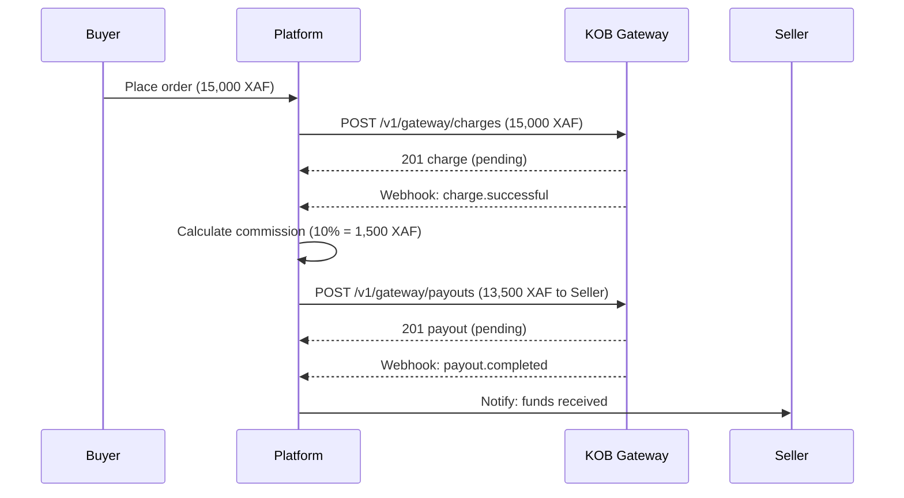

# Build a Marketplace Checkout

> **Who is this for?** Platforms that collect payments from buyers, take a commission, and disburse the remainder to sellers.

## Architecture Overview



## What You Will Build

This guide walks through the complete lifecycle of a marketplace transaction:

1. Collect payment from the buyer
2. Handle payment success and failure
3. Calculate platform commission
4. Disburse funds to the seller
5. Handle payout failures and reversals
6. Reconcile the settlement

## Prerequisites

| Requirement | Details |
|-------------|---------|
| API key | `sk_test_...` or `sk_live_...` |
| Webhook endpoint | HTTPS URL that returns 200 within 5 seconds |
| Seller onboarded | Seller must have completed KYB and have a valid payout destination |

## Step 1: Create the Buyer Charge

```bash
curl -X POST https://wdzkzeahdtxlynetndqw.supabase.co/functions/v1/gateway/charges \
  -H "Authorization: Bearer sk_test_YOUR_KEY" \
  -H "Content-Type: application/json" \
  -H "Idempotency-Key: order_2001_charge" \
  -d '{
    "amount": 15000,
    "currency": "XAF",
    "payment_method": "mobile_money",
    "customer": {
      "phone": "+237677000001",
      "name": "Buyer Name"
    },
    "description": "Order #2001 - Marketplace Purchase",
    "metadata": {
      "order_id": "2001",
      "seller_id": "seller_abc",
      "platform_fee": 1500
    }
  }'
```

## Step 2: Handle the Charge Webhook

Your webhook handler must process both success and failure:

```javascript
app.post('/webhooks/kob', (req, res) => {
  // 1. Verify signature
  const signature = req.headers['x-kob-signature'];
  const computed = crypto
    .createHmac('sha256', WEBHOOK_SECRET)
    .update(JSON.stringify(req.body))
    .digest('hex');

  if (`sha256=${computed}` !== signature) {
    return res.status(401).send('Invalid signature');
  }

  // 2. Deduplicate by event ID
  const eventId = req.headers['x-kob-event-id'];
  if (alreadyProcessed(eventId)) {
    return res.status(200).send('Already processed');
  }

  // 3. Process event
  const { event, data } = req.body;

  switch (event) {
    case 'charge.successful':
      // Mark order as paid, queue seller payout
      markOrderPaid(data.metadata.order_id);
      queueSellerPayout(data);
      break;

    case 'charge.failed':
      // Mark order as failed, notify buyer
      markOrderFailed(data.metadata.order_id, data.failure_reason);
      break;

    case 'payout.completed':
      // Mark seller as paid
      markSellerPaid(data.payout_id);
      break;

    case 'payout.failed':
      // Queue for manual review
      flagForReview(data.payout_id, data.failure_reason);
      break;

    case 'payout.reversed':
      // Funds returned -- retry or escalate
      handlePayoutReversal(data);
      break;
  }

  res.status(200).send('OK');
});
```

## Step 3: Calculate Commission and Disburse

After the charge succeeds, calculate the platform fee and disburse the remainder:

```python
def queue_seller_payout(charge_data):
    order_id = charge_data["metadata"]["order_id"]
    seller_id = charge_data["metadata"]["seller_id"]
    platform_fee = int(charge_data["metadata"]["platform_fee"])
    seller_amount = charge_data["amount"] - platform_fee

    # Create payout to seller
    resp = requests.post(
        "https://wdzkzeahdtxlynetndqw.supabase.co/functions/v1/gateway/payouts",
        headers={
            "Authorization": f"Bearer {API_KEY}",
            "Content-Type": "application/json",
            "Idempotency-Key": f"payout_order_{order_id}",
        },
        json={
            "amount": seller_amount,
            "currency": "XAF",
            "recipient": get_seller_payout_details(seller_id),
            "description": f"Marketplace payout for Order #{order_id}",
            "metadata": {
                "order_id": order_id,
                "charge_id": charge_data["charge_id"],
                "platform_fee": platform_fee,
            },
        },
    )
    return resp.json()
```

## Step 4: Handle Payout Failures

If the payout to the seller fails:

```javascript
async function handlePayoutFailure(payoutData) {
  const { failure_reason, payout_id } = payoutData;

  switch (failure_reason) {
    case 'invalid_account':
      // Notify seller to update their payout details
      await notifySeller(payoutData.metadata.seller_id,
        'Your payout failed due to invalid account details. Please update your payment information.');
      break;

    case 'provider_unavailable':
      // Retry with backoff
      await retryPayoutWithBackoff(payout_id);
      break;

    case 'insufficient_balance':
      // Queue for next settlement cycle
      await queueForNextSettlement(payoutData);
      break;

    default:
      // Escalate to operations team
      await escalateToOps(payout_id, failure_reason);
  }
}
```

## Step 5: Settlement Reconciliation

At the end of each day, reconcile your records:

```bash
# Fetch all charges for the day
curl "https://wdzkzeahdtxlynetndqw.supabase.co/functions/v1/gateway/charges?created_after=2026-03-23T00:00:00Z&created_before=2026-03-24T00:00:00Z&status=successful&limit=100" \
  -H "Authorization: Bearer sk_test_YOUR_KEY"

# Fetch all payouts for the day
curl "https://wdzkzeahdtxlynetndqw.supabase.co/functions/v1/gateway/payouts?created_after=2026-03-23T00:00:00Z&created_before=2026-03-24T00:00:00Z&limit=100" \
  -H "Authorization: Bearer sk_test_YOUR_KEY"
```

### Reconciliation Formula

```
Total Charges (successful)   = 150,000 XAF
Total Payouts (completed)    = 135,000 XAF
Platform Commission          =  15,000 XAF
Net Balance                  = Total Charges - Total Payouts = Platform Commission
```

## Production Considerations

| Area | Recommendation |
|------|---------------|
| Idempotency | Use `order_{id}_charge` and `payout_order_{id}` patterns to prevent duplicates |
| Webhook reliability | Process events asynchronously. Return 200 immediately, then handle in a queue |
| Partial failures | In bulk operations, check each item's status individually |
| Refunds | When a buyer requests a refund, reverse the seller payout first (if not yet disbursed) |
| Compliance | Ensure sellers have completed KYB before processing payouts above 500,000 XAF |
| Monitoring | Alert when payout failure rate exceeds 5% or when settlement reconciliation shows discrepancies |

## Error Reference for This Flow

| Error Code | When | Recovery |
|------------|------|----------|
| PAY_001 | Charge amount below 100 XAF | Set minimum order value to 100 XAF |
| PAY_002 | Buyer payment declined | Prompt buyer to use different payment method |
| PAY_010 | Insufficient settlement balance for payout | Wait for charges to settle (T+1) |
| MM_003 | Buyer did not approve MoMo prompt | Retry with same idempotency key |
| MM_004 | Provider unavailable | Retry with exponential backoff |
