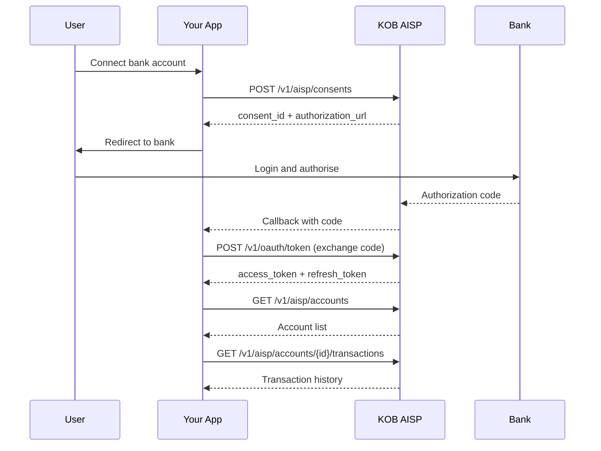

# Build a Bank Data Aggregator

> **Who is this for?** Fintechs building account aggregation, personal finance management (PFM), or credit scoring applications using Open Banking AISP.

## Architecture Overview



## What You Will Build

This guide covers the complete AISP integration lifecycle:

1. Create and authorize a consent
2. Fetch accounts and balances
3. Sync transaction history
4. Handle token refresh automatically
5. Manage consent expiry and revocation
6. Handle edge cases and failures

## Prerequisites

| Requirement | Details |
|-------------|---------|
| OAuth 2.0 client | Registered with `accounts`, `balances`, `transactions` scopes |
| Redirect URI | Registered in your client configuration |
| PKCE support | Required for all authorization flows (FAPI 1.0 Advanced) |

## Step 1: Create an AISP Consent

```bash
curl -X POST https://wdzkzeahdtxlynetndqw.supabase.co/functions/v1/aisp/consents \
  -H "Authorization: Bearer <CLIENT_TOKEN>" \
  -H "Content-Type: application/json" \
  -d '{
    "permissions": [
      "ReadAccountsDetail",
      "ReadBalances",
      "ReadTransactionsDetail"
    ],
    "expiration_date": "2026-06-23T00:00:00Z",
    "transaction_from_date": "2026-01-01T00:00:00Z",
    "transaction_to_date": "2026-06-23T00:00:00Z"
  }'
```

### Response

```json
{
  "consent_id": "cns_abc123",
  "status": "awaiting_authorization",
  "authorization_url": "https://wdzkzeahdtxlynetndqw.supabase.co/functions/v1/oauth/authorize?request_uri=urn:kob:par:xyz",
  "permissions": ["ReadAccountsDetail", "ReadBalances", "ReadTransactionsDetail"],
  "expiration_date": "2026-06-23T00:00:00Z",
  "created_at": "2026-03-23T10:00:00Z"
}
```

## Step 2: Redirect User for Authorization

Redirect the user to the `authorization_url`. After they log in and authorise at their bank, they are redirected back to your `redirect_uri` with an authorization code.

```javascript
// In your callback handler
const { code, state } = req.query;

// Exchange code for tokens (with PKCE)
const tokenResponse = await fetch('https://wdzkzeahdtxlynetndqw.supabase.co/functions/v1/oauth/token', {
  method: 'POST',
  headers: { 'Content-Type': 'application/x-www-form-urlencoded' },
  body: new URLSearchParams({
    grant_type: 'authorization_code',
    code: code,
    redirect_uri: REDIRECT_URI,
    client_id: CLIENT_ID,
    code_verifier: storedCodeVerifier, // From the PKCE flow
  }),
});

const { access_token, refresh_token, expires_in } = await tokenResponse.json();
// Store tokens securely (encrypted at rest)
await storeTokens(userId, access_token, refresh_token, expires_in);
```

## Step 3: Fetch Accounts and Balances

```python
import requests

def fetch_accounts(access_token):
    headers = {"Authorization": f"Bearer {access_token}"}

    # Get accounts
    accounts = requests.get(
        "https://wdzkzeahdtxlynetndqw.supabase.co/functions/v1/aisp/accounts",
        headers=headers,
    ).json()

    # Get balances for each account
    for account in accounts["data"]:
        balances = requests.get(
            f"https://wdzkzeahdtxlynetndqw.supabase.co/functions/v1/aisp/accounts/{account['id']}/balances",
            headers=headers,
        ).json()
        account["balances"] = balances["data"]

    return accounts
```

## Step 4: Sync Transaction History

Implement incremental sync using date-based pagination:

```javascript
async function syncTransactions(accountId, accessToken, lastSyncDate) {
  let offset = 0;
  const limit = 100;
  let allTransactions = [];

  while (true) {
    const response = await fetch(
      `https://wdzkzeahdtxlynetndqw.supabase.co/functions/v1/aisp/accounts/${accountId}/transactions` +
      `?from_date=${lastSyncDate}&limit=${limit}${cursor ? `&cursor=${cursor}` : ""}`,
      { headers: { 'Authorization': `Bearer ${accessToken}` } }
    );

    if (response.status === 401) {
      // Token expired -- refresh and retry
      accessToken = await refreshAccessToken(accountId);
      continue;
    }

    const data = await response.json();
    allTransactions = allTransactions.concat(data.data);

    if (data.data.length < limit) break; // No more pages
    offset += limit;
  }

  return allTransactions;
}
```

## Step 5: Automatic Token Refresh

Access tokens expire after 15 minutes. Implement proactive refresh at 80% lifetime (12 minutes):

```python
import time
import threading

class TokenManager:
    def __init__(self, client_id, refresh_token):
        self.client_id = client_id
        self.refresh_token = refresh_token
        self.access_token = None
        self.expires_at = 0

    def get_token(self):
        # Refresh proactively at 80% of lifetime
        if time.time() > self.expires_at - 180:  # 3 min buffer
            self._refresh()
        return self.access_token

    def _refresh(self):
        resp = requests.post(
            "https://wdzkzeahdtxlynetndqw.supabase.co/functions/v1/oauth/token",
            data={
                "grant_type": "refresh_token",
                "refresh_token": self.refresh_token,
                "client_id": self.client_id,
            },
        )
        data = resp.json()

        if resp.status_code == 401:
            # Refresh token revoked or reuse detected
            # Must re-authenticate from scratch
            raise ReauthenticationRequired(
                "Refresh token invalid. User must re-authorize."
            )

        self.access_token = data["access_token"]
        # IMPORTANT: Store the NEW refresh token (rotation)
        self.refresh_token = data["refresh_token"]
        self.expires_at = time.time() + data["expires_in"]
```

## Step 6: Handle Consent Expiry and Revocation

### Consent Expiry

Consents have a maximum lifetime (typically 90 days). Schedule renewal before expiry:

```javascript
async function checkConsentStatus(consentId, accessToken) {
  const response = await fetch(
    `https://wdzkzeahdtxlynetndqw.supabase.co/functions/v1/aisp/consents/${consentId}`,
    { headers: { 'Authorization': `Bearer ${accessToken}` } }
  );
  const consent = await response.json();

  const daysUntilExpiry = Math.floor(
    (new Date(consent.expiration_date) - new Date()) / (1000 * 60 * 60 * 24)
  );

  if (daysUntilExpiry <= 7) {
    // Notify user to re-authorize
    await notifyUser(consent.user_id,
      'Your bank connection expires in ' + daysUntilExpiry + ' days. Please re-authorize.');
  }

  return consent;
}
```

### Consent Revocation

The user or bank may revoke consent at any time. Handle `consent.revoked` webhook:

```json
{
  "event": "consent.revoked",
  "consent_id": "cns_abc123",
  "timestamp": "2026-04-15T08:00:00Z",
  "data": {
    "revoked_by": "user",
    "reason": "user_requested"
  }
}
```

## Error Reference for This Flow

| Error Code | When | Recovery |
|------------|------|----------|
| AISP_001 | Consent not found or expired | Create a new consent and redirect user for authorization |
| AISP_002 | Missing permission (e.g., ReadTransactions not granted) | Create a new consent with the required permissions |
| AISP_003 | Account not found | List accounts first, then use a valid account_id |
| AISP_004 | Consent revoked by user or bank | Notify user and request re-authorization |
| AISP_005 | Bank account closed | Remove from sync schedule and notify user |
| AUTH_002 | Access token expired | Use refresh token to obtain a new access token |
| AUTH_004 | Refresh token invalid (reuse detection) | Full re-authentication required |

## Production Considerations

| Area | Recommendation |
|------|---------------|
| Token storage | Encrypt refresh tokens at rest. Never store in client-side storage |
| Sync frequency | Sync balances every 4 hours, transactions every 6 hours during business hours |
| Rate limits | Respect X-RateLimit-Remaining. Implement per-bank rate limiting |
| Data retention | Follow COBAC data residency rules -- data must remain in CEMAC zone |
| Consent management | Display connected banks in your UI with disconnect option |
| Monitoring | Alert on consent revocation rate spikes or elevated AISP error rates |
